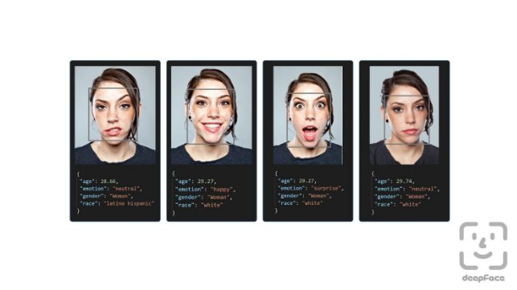

**HOW TO INSTALL:**
 
```pip install -r requirements.txt```

**HOW TO RUN:**
```
python Face_info.py --input webcam
python Face_info.py --input image --path_im "/path/to/image"
python Face_info.py --input video --path_im "/path/to/video"
```

**NOTE:** audio gender recognition is available only with video


University of Catania

Project curated by Stefano Di Patti

MULTIMEDIA & COMPUTER VISION PROJECT REPORT

**SOFT BIOMETRIC RECOGNITION**

Developed in Python3



**INTRODUCTION**

The project presented deals with the study of one of the most popular topics in the scientific community of the last decade: Soft Biometric Recognition. It is an analysis of human traits such as race, sex, age, weight, height etc... using multimedia data manipulation technologies and machine learning.

Specifically, the software developed in Python3 exploits some of the most famous Image Processing libraries such as OpenCV and Deepface to identify the most characteristic human traits both with images, Real Time Videos (webcams) and videos with audio tracks as input.

Age, sex, race, emotions, hair type and beard are the data that, once analyzed, will be shown to the user in a special window.

**AGE, GENDER AND RACE DETECTION**

During the first part of the software design, the DeepFace library was used. Deepface is a framework for Python that allows easy use of methods for face recognition and the analysis of facial attributes (age, gender, emotions and race).

It is a hybrid facial recognition system that contains some famous models:VGG-Face , [Google FaceNet ,](https://sefiks.com/2018/09/03/face-recognition-with-facenet-in-keras/)[OpenFace ,](https://sefiks.com/2019/07/21/face-recognition-with-openface-in-keras/)[Facebook DeepFace ,DeepID](https://sefiks.com/2020/02/17/face-recognition-with-facebook-deepface-in-keras/)[ ,ArcFace](https://sefiks.com/2020/06/16/face-recognition-with-deepid-in-keras/)[ andDlib](https://sefiks.com/2020/12/14/deep-face-recognition-with-arcface-in-keras-and-python/) .

The library is mainly based on Keras and TensorFlow.

**AGE DETECTION**

The prediction model used uses pre-trained weights. Mainly the implementation was based on the Caffe framework but was converted to a template for Keras/TensorFlow.

The dataset used is a collection of facial images taken from Wikipedia (1 GB): <https://data.vision.ee.ethz.ch/cvl/rrothe/imdb-wiki/>

In addition to the images, there are the various birthday dates of the subjects in question. Being in possession of the date of birth and the date the photo was taken, it is possible to calculate the estimated age by subtracting the two, ensuring that it falls within a range between 0 and 100.

Age prediction is a regression problem, but you can think of it as a classification problem where the 101 classes represent the output layer of age from 0 to 100. To do this you use what is called “transfer learning” leveraging VGG for imagenets. The final dataset will therefore be made up of 22578 references divided into 15905 training and 6673 testing.

The choice is to use VGG-Face model to obtain the weights, a model focused on face recognition that allows us to obtain feedback from human patterns:

<https://drive.google.com/file/d/1CPSeum3HpopfomUEK1gybeuIVoeJT_Eo/view?usp=sharing>

The weights of the first layers will be blocked because they may already detect some patterns. Assembling your network from scratch may cause you to lose this important information. It is therefore preferable to freeze all levels except the last three convolution levels.

Since this is a multi-class classification problem, the loss function must be "categorical crossentropy". The optimization algorithm chosen is Adam for faster loss convergence. To avoid overfitting, the batch\_size value was set to 256, while the number of epochs corresponds to 250.

Evaluating the model results in only 24% accuracy, which seems like a bad result but in fact it is not. The researchers claim that multiplying each softmax value with its label will result in age prediction. The model used predicts an error of ±4.65 years on average, which is acceptable.


*1. Evaluation formula*

The Ɛ value of the model is 0.387378, and the MeanAbsoluteError is 7.887859 for 1079 instances. The reference Ɛ value for humans is 0.34, so the model used is less accurate than other research but closer to human age prediction.


**GENDER DETECTION**

The dataset used is that of IMDB (7 GB) at the same link as the one used to solve the age identification problem:

<https://data.vision.ee.ethz.ch/cvl/rrothe/imdb-wiki/>

We apply binary coding for sex prediction, and then define two classes in the output layer for males and females. The model has the following accuracy and validation loss values:

[0.07324957040103375, 0.9744245524655362]

So it's very satisfying.

This, unlike age prediction, is a full-fledged classification problem. Accuracy should not be the only metric to monitor, but also precision and recall. The model generates the following confusion matrix:


<table>
<tr><td colspan="2" rowspan="2"></td><td colspan="2" valign="top"><b>Prediction</b></td></tr>
<tr><td colspan="1" valign="top"><b>Female</b></td><td colspan="1" valign="top"><b>Bad</b></td></tr>
<tr><td colspan="1" rowspan="2" valign="top"><b>Actual</b></td><td colspan="1" valign="top"><b>Female</b></td><td colspan="1" valign="top">1873</td><td colspan="1" valign="top">98</td></tr>
<tr><td colspan="1" valign="top"><b>Bad</b></td><td colspan="1" valign="top">72</td><td colspan="1" valign="top">4604</td></tr>
<tr><td colspan="4" valign="top"><i>2. Gender Detection Confusion Matrix</i></td></tr>
</table>

Indicating that a precision of 96.29% and recall of 95.05% was achieved. Metrics that satisfy the model such as accuracy.

**RACE DETECTION**

The dataset used is that of FairFace, which includes 86k references for training and 11k for testing: https://[github.com/joojs/fairface](https://github.com/joojs/fairface)

The labels used to classify images are:East Asian, Southeast Asian, Indian, Black, White, Middle Eastern, and Latino-Hispanic.

Another dataset taken into consideration is that of UTKFace, smaller with 10k references in general. The labels in this case are: Asian, Indian, Black; White and Others (Latin and Middle Eastern).

<http://aicip.eecs.utk.edu/wiki/UTKFace>

Combining the two datasets increases the accuracy from 68% to 72%, obviously modifying the Latino and Middle Eastern categories with Others. The modification does not significantly increase the results, so only the FairFace dataset was used, with the modification to unify the two Asian classes into a single one. The number of instances for each race is homogeneous in the dataset:


3. *Race distribution in FairFace Dataset*

The original dataset includes the names of the images and the relative race, so the procedure carried out is to read the pixels of the images based on the file name, and then store them as if they were a column in a specific list structure.


4. *Pixels stored in Dataset*


Each line is scaled as (224,224,3), however each input must be normalized for neural networks due to activation functions. All of this represents the input feature passed to the neural network. The race reference column will be the result you want to predict. Before proceeding to the training phase it is necessary to separate the training data into train and validation to avoid overfitting. In this case the “early sopping” technique is used. VGG-Face will be used for transfer learning. The first layers can immediately identify facial patterns.

We therefore don't need to train it from scratch because we don't have millions of training instances. We can block the first layers and wait for the last ones to learn. In this way the last 7 layers cannot update their weights and it is expected that these will learn something. Rather than feed all the train data to the network, it is preferable to feed it in batches. The best result is obtained with a batch\_size of 16,384 (2̂ 14). So 16k references are randomly selected and fed to the network for each epoch. When the validation loss stops increasing for 50 cycles, then training must be terminated to avoid overfitting. When the epochs exceed 30 the train loss decreases while the validation loss increases, presenting overfitting. Loading the weights for the best iteration avoids the problem. The network is then trained with the train data and the validation set is used to apply the "early stop".

Epoch is the best iteration for validation, but the network may store the validation set, not solving the overfitting problem. It is expected that using the test set, the validation loss is close to that obtained for training if the model is robust. In both cases the value obtained is, in fact, 0.88 while the accuracy is 68%. It could already be stated that the model gives concrete results, but since it is a classification problem, the precision and recall values   must be defined. The confusion matrix is   shown below:


5. *Race Detection Confusion Matrix*

**EMOTION DETECTION**

The dataset used is the following: <https://www.kaggle.com/jonathanoheix/face-expression-recognition-dataset>

This is a database of 22821 images for training and 7066 used for the testing phase. All images have a resolution of 48x48 and before being fed to the neural network for training they are preprocessed (resize, grayscale, conversion to numpy) and a Data Augmentation process is implemented (scaling, rotation, etc... ).

Emotion prediction is carried out using the same methodology described previously. Here too a file with pre-processed weights is used. This is always a problem solved with categorical\_crossentropy and the Adam algorithm.

It is a classification problem with 7 outputs: angry, disgust, fear, happy, sad, neutral, surprise. The model, once trained with a batch value of 512, has an accuracy of 70%. A procedure for Face detection via haarcascade will therefore be applied to the input image and then evaluated by the created model. The Confusion Matrix is   also shown below:

 

6. *Emotion Detection Confusion Matrix*

Evaluation: [0.9805508852005005, 0.6304839849472046]

**BEARD DETECTION**

The study to identify the presence of a beard or not was addressed with a dataset of 196 images taken on the internet of famous actors. The dataset was divided into two subsets to which the reference label 0 and 1 was assigned.

The next step is to normalize the color range from (0 to 255) to (0 to 1) by dividing the data by 255.0. These images are then “reshaped” into a 4-dimensional numpy matrix.

However, during the various tests carried out in runtime, the model does not seem to work effectively with the presence of noise and the lack of a light source.

**EYES COLOR DETECTION**

This problem was not treated with machine learning technologies as in previous cases.

The methodology used was to identify the key colors that human eyes present and classify them in digital format with ranges in the HSV color space, considered more efficient, effective and plausible than the classic format used for RGB images. The iris has pigmentation that determines the color of the eye. The scientifically identified classes are: amber, blue, brown, grey, green, hazelnut or red. The labels chosen for their description are: Blue, Blue Gray, Brown, Brown Gray, Brown Black, Green, Green Gray, Other. The ranges established for their identification were taken from the following publication:

[https://github.com/jeffreyolchovy/whatismyeyecolor/blob/master/library/src/main/scala/com/w hatismyeyecolor/ColorRange.scala](https://github.com/jeffreyolchovy/whatismyeyecolor/blob/master/library/src/main/scala/com/whatismyeyecolor/ColorRange.scala)

As regards the eyes detection part, the MTCNN library was used. It is a tool for face detection which, giving an image of a person as input, returns a JSON list with the facial keypoints as output. Those of the eyes are taken and passed to a function that will identify the color of the eyes, simply by making a cascade comparison with the defined color classes.


This is not a fully functional approach as it is highly dependent on external factors such as: input resolution, ambient brightness, glasses reflection, etc. More than half of the image tests gave a true result. In real-time, however, things get complicated and the algorithm loses precision. Before implementing this implementation, tests were carried out in which rather than using ranges, the color taken from the MTCNN feature was searched for in a palette in csv format containing all the colors of the HSV space. This method proved to be too burdensome for the machine, especially when testing with video and real-time data.

**HAIR TYPE RECOGNITION**

The dataset chosen is that of Figaro1k, a database of more than a thousand images of haircuts divided into 7 classes: straight, wavy, curly, kinky, braids, dreadlocks, short-men (afro, corti\_uomo, dread, lisci, wavy, curls, braid).

<http://projects.i-ctm.eu/it/progetto/figaro-1k>

In addition to images, the dataset also presents masks useful for hair segmentation. The study addressed here is divided into two modalities: classification of original images and classification of segmented images. In both, machine learning was used with the technologies mentioned above.

During the segmentation process, the first step was to define a neural network to train the masks. The dataset was divided into train and validation using sklearn and once the model was trained with a batch\_size of 64, Adam optimizer and MSE loss function, an accuracy of 93% was obtained. In fact, the model worked well both with images and in real time. However, it was necessary to define a neural network capable of exploiting the first model to recognize the type of haircut. The recreated procedure was to take an input image, extract the mask and evaluate its prediction with a 7-output classification model of the various haircuts. After various attempts, also involving the use of VGG-19 and Data Augmentation, the model never reported a sufficiently high accuracy.

The strategy used was therefore that of all the classification problems covered in the report. The images divided into subsets are pre-processed and fed to the network in order to learn their classification.

The final model has an accuracy of approximately 50%.

**GENDER DETECTION FROM AUDIO**

The dataser used for the training is the one developed by Youtube and consists of 5 minutes of dialogues for each sex, with reference to 5 distinct males and 5 females (1 minute/speaker).

The dataset used for testing is an extract from "AudioSet", released by Google in 2017 and containing 558 female dialogues and 546 male dialogues. All audio files have a duration of 10 seconds and contain speech expressions sampled at 16000Hz.

To work with audio signals in the training phase, common features present in dialogues known as Mel Frequency Cepstrum Coefficients (MFCCs) are extracted. It is well known, in fact, that these contain the information useful for determining sex (among other things). The 2 sex models are built using the ML - Gaussian Mixture Models (GMMs) technique. A GMM will take as input the MFCCs of the training samples and try to learn their distribution representing gender. When a gender of a new voice is recognized, first the MFCCs of the sample will be extracted and then the trained GMM model will be used to calculate the feature results. The model with the maximum 

score is predicted as the gender of the tested dialogue.

***1. Treatment of speech frames***

A speech signal is defined as a sequence of numbers that denote the range of speech uttered by the speaker. Since it is a non-stationary signal, its frequency presents continuous changes over time. Before proceeding with any type of analysis of the signal, such as establishing the frequency contents in small time intervals (Short Term Fourier Transform of the signal), the signal must be made stationary. The vowel is, therefore, divided into small frames lasting 20-30 ms, as the shape of the vocal tracts can be assumed to be invariant for small time intervals. Frames smaller than this duration would not present enough samples to allow a good estimate of the components of the frequency considered, while with longer frames the signal could change too much within the frame itself, rendering the hypothesis of the stationarity condition null and void.

 

7. Framing

Extracting raw frames from a speech signal can lead to discontinuities towards endpoints due to the non-integer number of periods in the extracted waveform, which will then lead to an incorrect frequency representation (known as spectral loss in processing jargon of the signal). You can predict this phenomenon by multiplying a “window function” with the speech frame. The amplitude of this function gradually decreases to zero towards its two ends and therefore this multiplication minimizes the amplitude of the discontinuities mentioned above. The operation is known as Windowing.


8. *Windowing*

Due to windowing, we are actually losing samples towards the beginning and end of the frame; this will also lead to an incorrect frequency representation. To compensate for this loss, we take overlapping frames instead of disjoint frames, so that the lost samples from the end of the i-th frame and the beginning of the (i + 1)-th frame are entirely included in the frame formed by the overlap between these 2 frames . The overlap between frames is generally considered to be 10-15 ms. This technique is known as Overlapping Frames.


9. *Frame Overlapping*
2. ***MFCC feature extraction***

After extracting the speech frames, we now proceed to derive the MFCC features for each frame. Speech is produced by man through a filtration produced by our vocal tract on the air expelled from our lungs. The properties of the source (lungs) are common to all speakers; are the properties of the vocal tract, which is responsible for shaping the signal spectrum and varies from person to person. The shape of the vocal tract governs the sound produced, and MFCCs best represent this shape.

MFCCs are mel frequency cephalic coefficients, i.e. some transformed values   of the signal in the cephalic domain. From the theory of speech production, speech is assumed to be a convolution of the source (air expelled from the lungs) and the filter (our vocal tract). The goal here is to characterize the filter and remove the source part. To do this we transform the time domain speech signal into a spectral domain signal using the Fourier transform where the source and filter part are now multiplying. We now take the log of the transformed values   so that the source and filter are now additive in the spectral domain of the log.

Using log to transform from multiplication to makes it easy to separate source and filter using a linear filter. Finally, the discrete cosine transform (found to be more successful than FFT or I-FFT) of the logarithmic spectral signal is applied to obtain MFCC. Initially the idea was to transform the log spectral signal into a time domain using Inverse-FFT but 'log' being a non-linear operation created new frequencies called Quefrency or you can assert that it transformed the log spectral signal into a new domain called the cepstral domain.

The reason for the term "mel" in MFFC is the mel scale which specifies exactly how to space our frequency regions. Humans are much better at discerning small changes in pitch at low frequencies than they are at high frequencies. By incorporating this scale, our characteristics more closely match what humans feel.

3. ***Model training***

To build a gender detection system from the above extracted features, we need to define a model for both genders. We employ GMM for this task.

A Gaussian mixture model is a probabilistic clustering model for representing the presence of subpopulations within an overall population. The idea of   training a GMM is to approximate the probability distribution of a class by a linear combination of "k" Gaussian distributions/clusters, also called components of the GMM. The probability of data points (feature vectors) for a model is given by the following equation:

 (1)

Where  is the Gaussian Distribution.

 (2)

Initially, it identifies k clusters in the data using the K-means algorithm and assigns equal weight to each cluster. The k Gaussian distributions are then fitted to these k clusters. Metrics and all clusters are updated cyclically until convergence. The most commonly used method for this estimation is the Expectation Maximization (EM) algorithm.

Python's sklearn.mixture package is used to learn a GMM from the feature matrix containing the MFCC features. The GMM object requires that the number of components n\_components is fitted to the data, the number of iterations n\_iter is tested to estimate the parameters of these n components, the covariance type covariance\_type must be assumed between the features and the number of times n\_ init must K media initialization must be performed. The initialization that gave the best results is retained. The fit() function then estimates the model parameters using the EM algorithm.

4. ***Evaluation on the AudioSet subset***

Upon arrival of a test speech sample for gender detection, we extract its MFCC features, with a frame size of 25 ms and 10 ms overlap between frames. We then request the log- likelihood scores for each frame in the sample,

belonging to each genre e And must be calculated.

Using (2), the probability that the frame comes from a female voice is calculated. This is done for each of the k Gaussian components in the model, and the weighted sum of the k likelihoods from the components is taken according to the model parameter, just as in (1).

The logarithmic operation, when applied on the obtained sum, gives us the logarithmic probability value for the frame. This is repeated for all frames in the sample and the likelihoods of all frames are added.

Similarly, the probability that the speech is of male origin is calculated by substituting the parameter values   of the trained male GMM model and repeating the procedure described above for all frames.

***Results***

The following Confusion Matrix shows the results of the evaluation on the subset extracted from the AudioSet corpus. The approach performs brilliantly for the female gender, with an accuracy of 95%, while for the male gender the accuracy is 76%. The overall accuracy of the system is 86%.

<table>
<tr><td colspan="1" rowspan="1"></td><td colspan="1" valign="top"><b>Bad</b></td><td colspan="1" valign="top"><b>Female</b></td></tr>
<td colspan="1" valign="top"><b>Bad</b></td><td colspan="1" valign="top">417</td><td colspan="1" valign="top">129</td></tr>
<tr><td colspan="1" valign="top"><b>Female</b></td><td colspan="1" valign="top">29</td><td colspan="1" valign="top">529</td></tr>
<tr><td colspan="4" valign="top"><i>10. Gender Evaluation from Audio Prediction</i></td></tr>
</table>

In the implementation, the audio is taken from the video using the Moviepy library and saved in a directory. Through the librosa library, the audio will be loaded and its sampling will be established, so that it can be used to carry out the estimation using the model.

In the tests carried out, sampling appears to be decisive for identifying the correct sex class. With 16000Hz audio, like those used for training and testing, the model works according to the estimates just described. When sampling varies, accuracy decreases sharply.

**FINAL VIDEO AND REAL-TIME TESTS**

In the document all the conclusions described concern the study of images and audio files offline. During the development of the software, we wanted to integrate the possibility of carrying out Soft Biometric Recognition also via video files and using a webcam. To evaluate the correctness of the models described for these types of input, use was made of the VidTIMIT dataset.

The VidTIMIT dataset consists of video and audio recordings of 43 people, reciting short sentences chosen from the test section of the TIMIT corpus. The first two sentences for all people are the same, with the remaining eight generally different for each person. In addition to the sentences, each person performed a head rotation sequence in each session. Recordings were performed in an office environment using a broadcast-quality digital video camera. Each person's video is stored as a numbered sequence of JPEG images with a resolution of 512 x 384 pixels. The corresponding audio is stored as a mono, 16-bit, 32 kHz WAV file.

For each of these files, the first video for each of the people was reconstructed using external video editing software starting from the relevant image sequence and the attached audio file. There are therefore 43 videos taken into consideration for the study, in which the dialogue is the same for everyone but the subjects differ in biometric traits. Not having the subjects' original information available from the dataset, the analyzes carried out refer to my personal perception 
of their characteristics.

The conclusions drawn should therefore be considered as a reference to how accurate the software is likely to be to the analysis of an external person.

For possible future modifications, it would be possible to optimize the neural networks built in the cases that have demonstrated less accuracy, trying to implement external technologies such as VGG rather than Segmentation and Data Augmentation techniques to improve their efficiency.
